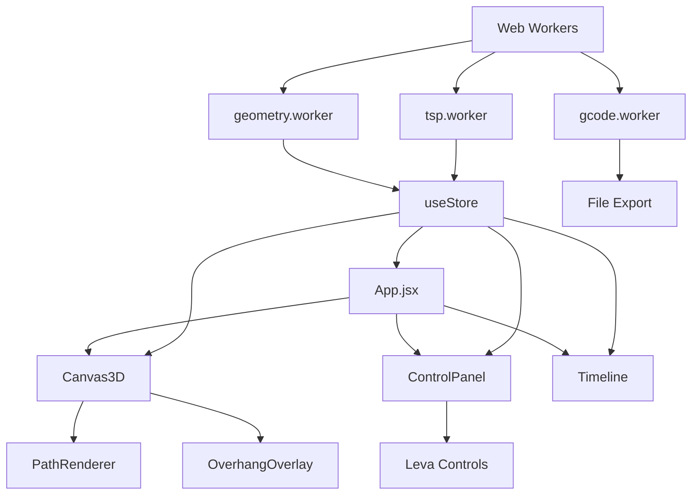

# ArchPrint Pro - 系統架構文檔

> **最後更新**: 2026-01-18
> **版本**: 0.1.0 (初始化)

---

## 1. 技術棧總覽

| 層級 | 技術 | 版本 | 用途 |
|------|------|------|------|
| 建置工具 | Vite | ^5.x | 開發伺服器 & 打包 |
| 前端框架 | React | ^18.x | UI 組件 |
| 3D 渲染 | Three.js | ^0.160.x | WebGL 渲染 |
| R3F 整合 | @react-three/fiber | ^8.x | Three.js React 封裝 |
| 狀態管理 | Zustand | ^4.x | 全域狀態 |
| 樣式 | Tailwind CSS | ^3.x | 原子化 CSS |
| 參數面板 | Leva | ^0.9.x | 調參 UI |
| 向量運算 | gl-matrix | ^3.x | 高效能幾何計算 |

---

## 2. 專案結構

```
src/
├── components/           # React 組件
│   ├── Canvas3D/        # 3D 場景
│   ├── ControlPanel/    # 控制面板
│   └── Timeline/        # 時間軸播放器
├── workers/             # Web Workers (重型運算)
│   ├── geometry.worker.js
│   ├── tsp.worker.js
│   └── gcode.worker.js
├── core/                # 核心邏輯
│   ├── analyzer.js      # 幾何分析
│   ├── optimizer.js     # 路徑優化
│   └── postProcessor.js # G-code 產生
├── stores/              # Zustand stores
│   └── useStore.js
├── utils/               # 工具函數
│   └── gcodeExporter.js
└── App.jsx
```

---

## 3. 數據結構

### 3.1 JSON 輸入格式 (來自 Grasshopper)

```typescript
interface PathJSON {
  header: {
    project_name: string;
    nozzle_diameter: number;  // mm
    layer_height: number;     // mm
    machine_flavor: 'Marlin' | 'KUKA' | 'ABB';
  };
  layers: Layer[];
}

interface Layer {
  layer_index: number;
  z_height: number;
  segments: Segment[];
}

interface Segment {
  type: 'printing' | 'travel';
  is_extruding: boolean;
  points: Point3D[];
}

interface Point3D {
  x: number;
  y: number;
  z: number;
}
```

### 3.2 Zustand Store 結構

```typescript
interface AppState {
  // 專案數據
  pathData: PathJSON | null;
  
  // 視覺化設定
  currentLayer: number;
  showOverhang: boolean;
  showTravelMoves: boolean;
  
  // 機器參數
  printSpeed: number;
  travelSpeed: number;
  pumpOnDelay: number;
  pumpOffAdvance: number;
  
  // 分析結果
  overhangHotspots: Hotspot[];
  slendernessRatio: number;
  
  // Actions
  loadPathData: (json: PathJSON) => void;
  setCurrentLayer: (layer: number) => void;
  updateSettings: (settings: Partial<AppState>) => void;
}
```

---

## 4. 模組依賴圖



---

## 5. 當前文件結構說明

| 文件 | 作用 |
|------|------|
| `package.json` | 專案配置，定義依賴與腳本指令 |
| `vite.config.js` | Vite 建置工具配置 |
| `tailwind.config.js` | Tailwind CSS 配置（content 路徑、主題擴展）|
| `postcss.config.js` | PostCSS 配置（引入 tailwindcss 和 autoprefixer）|
| `index.html` | 應用入口 HTML，掛載 React 根元素 |
| `src/main.jsx` | React 應用入口，渲染 App 組件至 DOM |
| `src/App.jsx` | 主應用組件，目前為 Vite 預設歡迎頁面 |
| `src/App.css` | App 組件樣式（全螢幕佈局）|
| `src/index.css` | 全域樣式（Tailwind 指令 + 深色主題）|
| `src/components/Canvas3D/index.jsx` | 3D 場景組件（OrbitControls, GridHelper）|
| `src/stores/useStore.js` | Zustand 全域狀態管理（pathData, currentLayer）|
| `src/components/FileUploader/index.jsx` | JSON 檔案導入組件 |
| `public/sample-path.json` | 測試用路徑數據（3 層，120x120cm）|
| `src/components/PathRenderer/index.jsx` | 3D 路徑渲染組件 |
| `src/components/LayerSlider/index.jsx` | 圖層滑桿控制組件 |
| `src/components/ControlPanel/index.jsx` | 右側控制面板（Leva 參數 + G-code 導出）|
| `src/core/postProcessor.js` | G-code 生成核心模組 |
| `src/utils/gcodeExporter.js` | G-code 檔案導出工具 |
| `src/utils/configParser.js` | PrusaSlicer INI 配置解析器 |
| `src/components/ConfigUploader/index.jsx` | Config.ini 導入組件 |

---

## 6. 變更日誌

| 日期 | 版本 | 變更內容 | 作者 |
|------|------|----------|------|
| 2026-01-18 | 0.1.0 | 初始化架構文檔 | AI |
| 2026-01-18 | 0.1.10 | Phase 1 完成：基礎場景與 JSON 導入 | AI |
| 2026-01-18 | 0.2.0 | Phase 2 完成：G-code 生成器 | AI |
| 2026-01-18 | 0.2.1 | 新增 Config.ini 導入功能 | AI |

---

## 7. 待實作功能

- [x] Phase 1: 基礎場景與 JSON 導入 ✅
- [x] Phase 2: G-code 後處理器 ✅
- [ ] Phase 3: 幾何分析引擎
- [ ] Phase 4: Web Worker 整合
- [ ] Phase 5: UI 優化與多設備支援
